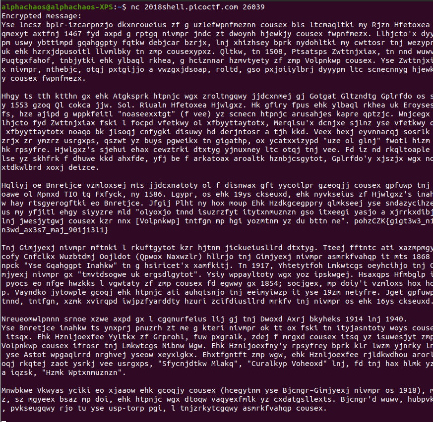

### Challenge Description

> My buddy Blaise told me he learned about this cool cipher invented by a guy also named Blaise! Can you figure out what it says? Connect with nc 2018shell.picoctf.com 26039.

### Challenge Hint

> There are tools that make this easy.  
> This cipher was NOT invented by Pascal

### Challenge Analysis

So let's look at what information we are given in the challenge.  

The challenge seems to be hinting very strongly toward the name `Blaise` a quick search of the term `Blaise cipher` reveals the following.`The Vigenère cipher is named after Blaise de Vigenère, although Giovan Battista Bellaso had invented it before Vigenère described his autokey cipher.`

Connecting to the remote server also gives us the following ciphertext

{:class="normal"}

So this is another common classic cipher, the Vigenère cipher. We solved a [similar challenge](2020-11-25-crypto-warmup-1.md) earlier in this series, but this time we don't have the key so we we'll need to do some analysis of the ciphertext, before we can brute force this one.

Again the easiest method is to find a good online tool for the job and then add it to our list on online resources.

this Time i'm recommending again I'm recommending one of my go to tools and that's the [https://www.boxentriq.com/ website](https://www.boxentriq.com/code-breaking/vigenere-cipher)

> Another alternative is to use or earlier [dcode.fr](https://dcode.fr) website or  
[https://www.guballa.de/vigenere-solver](https://www.guballa.de/vigenere-solver)

```commmon
Summary
--------------------------------
ciphertext = long section of ciphertext
Encryption/encoding used = ascii character so some classic cipher likely substitution cipher
flag format = not the normal so no picoCTF{} part
```

### Challenge Solution

Jumping to the recommending website we can easily decode this vigenère cipher and retrieve the flag.

### Flag

`picoCTF{v1gn3r3_c1ph3rs_ar3n7_bad_901e13a1}`
