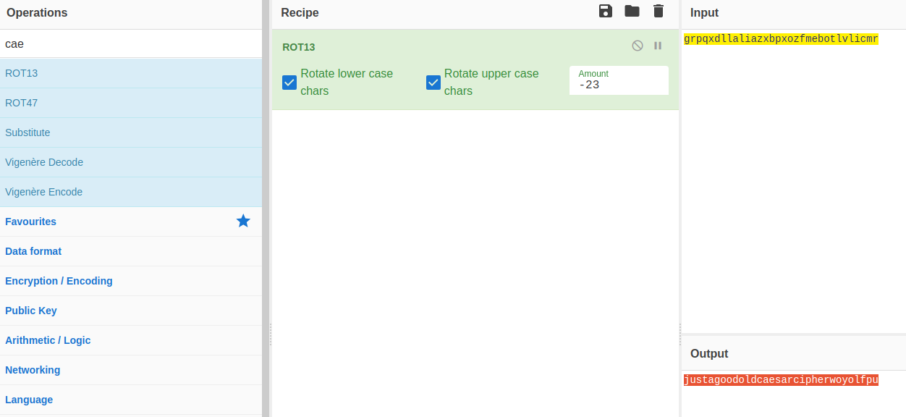
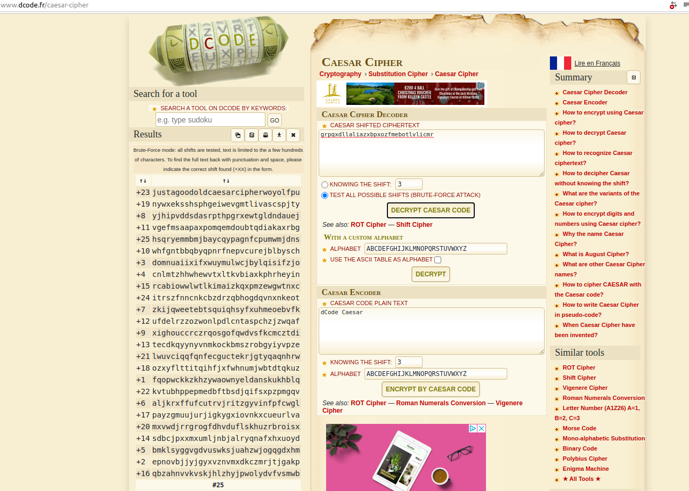

### Challenge Description

> This is one of the older ciphers in the books, can you decrypt the [message](../../assets/challs/picoctf2018/ciphertext)?

### Hint

> caesar cipher [tutorial](https://learncryptography.com/classical-encryption/caesar-cipher)

### Challenge Analysis

So let's look at what information we are given in the challenge.  

This challenge gives us the ciphertext in a file and also a hint that links us to a tutorial on the caesar cipher and how it works. It's also very similar to the earlier PicoCTF challenge we completed for [Crypto warmup 2](2020-11-25-crypto-warmup-2.md) about rot13.

```common
Summary
--------------------------------
ciphertext (from file) = picoCTF{grpqxdllaliazxbpxozfmebotlvlicmr}
tutorial: https://learncryptography.com/classical-encryption/caesar-cipher

```

### Challenge Solution

Again this challenge can be easily done by hand but if you want to advance in CTFs you'll end up using tools and scripts to speed up your challenge solving.

let's use my two recommended online sites Cyberchef and dcode.fr to solve this challenge and then have a quick look what a basic scripted solution might look like.

> Note:  You should have noticed that the outer part of the flag format hasn't been encrypted just the inner message section, so this is the only part we should be trying to decode. `picoCTF{grpqxdllaliazxbpxozfmebotlvlicmr}`

[CyberChef website](https://gchq.github.io/CyberChef/#recipe=ROT13(true,true,-23)&input=Z3JwcXhkbGxhbGlhenhicHhvemZtZWJvdGx2bGljbXI)

{:class="normal"}

[dcode.fr website](https://www.dcode.fr/caesar-cipher)

{:class="normal"}

### Flag

`picoCTF{justagoodoldcaesarcipherwoyolfpu}`
