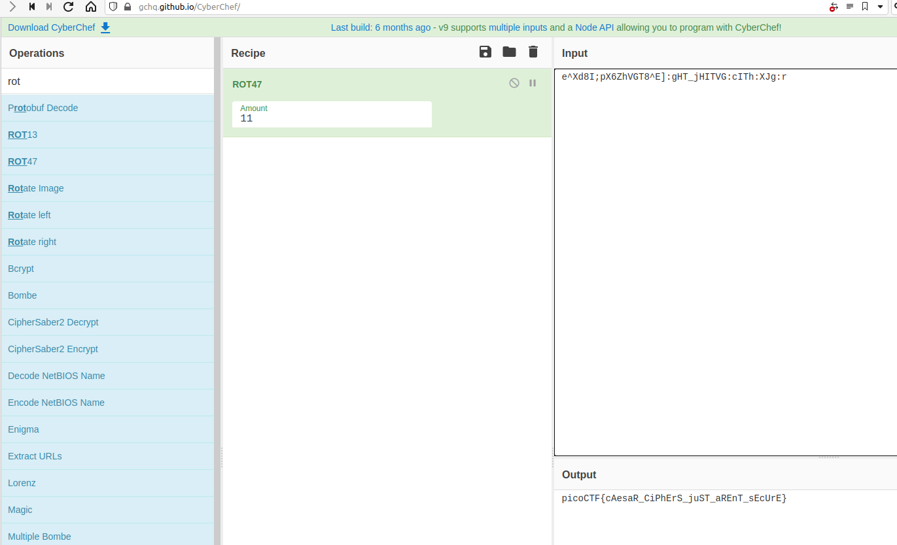

### Challenge Description

> Can you help us decrypt this [message?](../../assets/challs/picoctf2018/caesar_message.txt) We believe it is a form of a caesar cipher.

### Challenge Hint

> You'll have figure out the correct alphabet that was used to encrypt the ciphertext from the ascii character set  
> [ASCII Table](https://www.asciitable.com)

### Challenge Analysis

So let's look at what information we are given in the challenge.  

OK so again this is very similar to the [earlier caesar cipher](2020-11-25-caesar-cipher-1.md) challenge we solved. If we look at the ciphertext for this challenge we see `e^Xd8I;pX6ZhVGT8^E]:gHT_jHITVG:cITh:XJg:r`.

> **Hint:** If you remember earlier we mentioned that the normal caesar cipher just rotated over the normal a to z, alphabetical characters, but what if we changed this, what if we wanted to include digits and special characters etc. Well it works out we can rotate over all the printable ascii characters (all the ascii characters between 32 and 126). This again is a common cipher known as rot47, similar to how rot13 operates, except over all 94 printable characters so the same function can be used to encrypt and decrypt.  

```common
Summary
--------------------------------
ciphertext (from file) = e^Xd8I;pX6ZhVGT8^E]:gHT_jHITVG:cITh:XJg:r
The characters involved in the ciphertext suggest it's rotation over all the printable (special) characters

```

### Challenge Solution

This challenge could be done by hand using the ascii table provided in the hint. Again a more efficient method is to use our earlier recommended tool to solve it for us. So let's look at `Cyberchef` again to solve this one.

We have to rotate though each of the possible 94 values to find the correct rotational value used.

> **hint:** we could use the fact that it likely starts with picoCTF{ to speed this up

[CyberChef website](https://gchq.github.io/CyberChef/#recipe=ROT47(11)&input=IGVeWGQ4STtwWDZaaFZHVDheRV06Z0hUX2pISVRWRzpjSVRoOlhKZzpy)

{:class="normal"}

### Flag

`picoCTF{cAesaR_CiPhErS_juST_aREnT_sEcUrE}`
