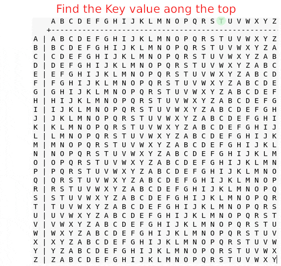
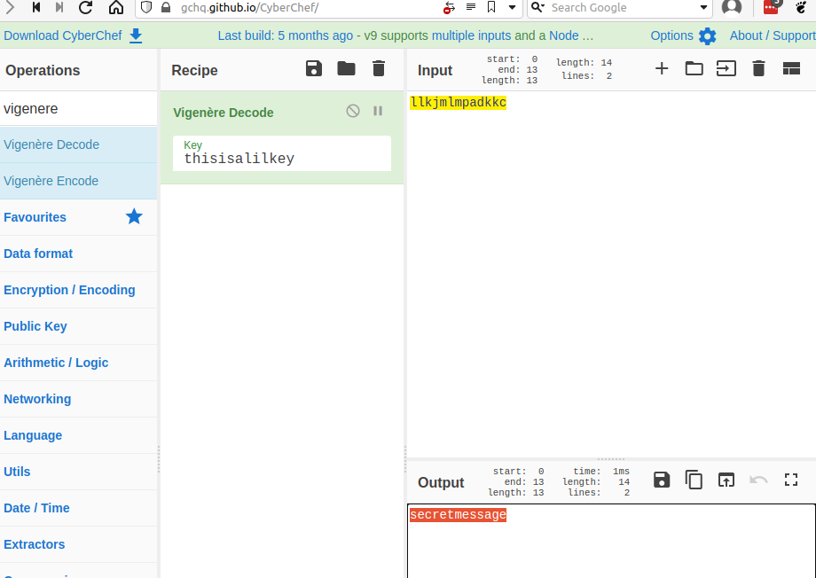
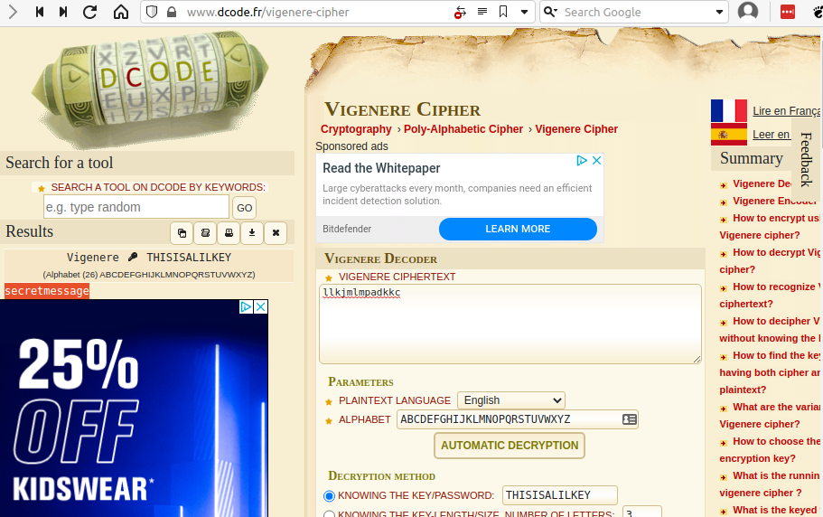

### Challenge Description

> Crypto can often be done by hand, here's a message you got from a friend, `llkjmlmpadkkc` with the key of `thisisalilkey`. Can you use this [table](../../assets/challs/picoctf2018/table.txt) to solve it?

### Challenge Hint

> Submit your answer in our competition's flag format. For example, if your answer was 'hello', you would submit 'picoCTF{HELLO}' as the flag.
Please use all caps for the message.

### Challenge Analysis

So let's look at what information we are given in the challenge.  

Firstly, we have an encoded message from our friend.  
This encoded message is what we call the `ciphertext`. The ciphertext is an encoded or encrypted version of the original message, and we'll need to decode/decrypt it before we can read the original message (usually called the `plaintext`) and solve the challenge.

The second piece of information we're given is the `key`.  
The key is part of what is used to encrypt/decrypt the plaintext/ciphertext.

The last piece of information we are given for this challenge is the table.  
The table shows us a grid of letters. The table is our hint at how our message might have been encoded.

> The steps used, or the method is often called the `algorithm`,and knowing the algorithm or method used is crucial to solving most challenges.

This particular challenge also gives us a free hint. The hint simply tells us that our final message will need to be put into the flag format `picoCTF{message}`.  In this case the hint doesn't appear to be overly useful, but in some challenges knowing the format of the final message can be extremely useful in solving the challenge, so always pay attention to every piece of information given in the challenge.

```commmon
Summary
--------------------------------
ciphertext = llkjmlmpadkkc
key = thisisalilkey
Encryption/encoding used = table?
```

### Challenge Solution

To solve this challenge we need to figure out how the table has been used with the key to encrypt our original plaintext message.

Looking at the ciphertext and the key you should notice that they are the same length, so each character of the key might map with each character of the ciphertext.

Examining the grid you should notice that each row and column has been labeled, kind of like a chess board or game of battleship. If we have a column and row value we can use the position where they meet or intersect as the result, like the x and y values used when plotting values in maths.

So we can now make a guess how the table might have been used to encode the original message and produce the ciphertext we now have. Let us see how we might reverse this process and decode the message and get the flag.

We're assuming that we use the table to look up the ciphertext character where the plaintext character and key character intersect. So a plaintext value of X and key value of C for example would give us a result of Z.

How would we reverse this process using a key value of C and ciphertext value of Z to get back the original plaintext value of X?

If we read the key value C from the top of the grid and read down the column until we find the ciphertext value Z and then read straight across that row we should get back our original plaintext value of X. We can continue this method until we have decoded the entire message and retrieved the flag.

{:class="normal"}

The animation above shows how we can decode the first character. Repeat the process to recover the final flag.

### Flag

Recovered message is SECRETMESSAGE and we just need to add the flag format to complete the challenge  
`picoCTF{SECRETMESSAGE}`

### Scripted Solution

```python
#!/usr/bin/env python3

def vigenere_encrypt(plaintext, key):
    key_as_int = [ord(i) for i in key]
    plaintext_int = [ord(i) for i in plaintext]
    ciphertext = ''
    for i in range(len(plaintext_int)):
        value = (plaintext_int[i] + key_as_int[i % len(key)]) % 26
        ciphertext += chr(value + 65)
    return ciphertext

def vigenere_decrypt(ciphertext, key):
    key_as_int = [ord(i) for i in key]
    ciphertext_int = [ord(i) for i in ciphertext]
    plaintext = ''
    for i in range(len(ciphertext_int)):
        value = (ciphertext_int[i] - key_as_int[i % len(key)]) % 26
        plaintext += chr(value + 65)
    return plaintext

ciphertext = "llkjmlmpadkkc"
key = "thisisalilkey"

plaintext = vigenere_decrypt(ciphertext,key)

print ("picoCTF{" + plaintext + "}")
```

### Extras

With some more experience or searching you might recognise this type of table as a `Vigenère square` or `Vigenère cipher`. This is a common cipher and as such there are plenty of tools online that will encrypt/decrypt these types of ciphers for you, or you may even want to write your own script to do the encryption/decryption functions. These smaller simpler challenges are perfect for practising or improving your scripting skills so I always suggest trying to script them. I've included a basic script you could use as a basis for your own.

### Useful Resources

A very useful site with plenty of tools is cyberchef from GCHQ in the UK. You can also download and run this tool locally if you prefer. Below is a screenshot using cyberchef to solve the challenge for us.

[CyberChef website](https://https://gchq.github.io/CyberChef/#recipe=Vigenère_Decode('thisisalilkey')&input=bGxram1sbXBhZGtrYwo)

{:class="normal"}

Another of my favourite sites for decoding these types of ciphers is dcode.fr (French ad English versions available).

[dcode.fr website](https://www.dcode.fr/vigenere-cipher)

{:class="normal"}
