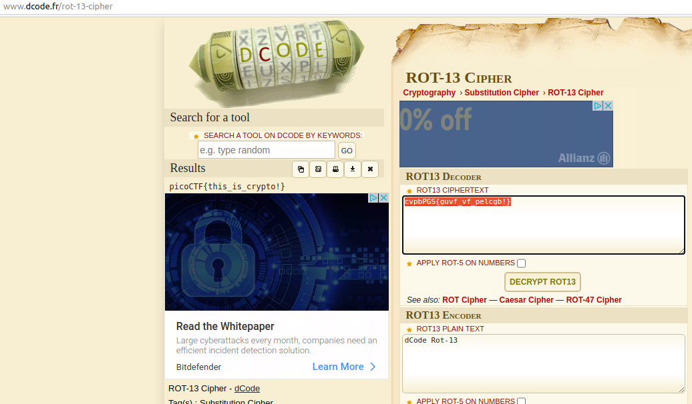

### Challenge Description

> Cryptography doesn't have to be complicated, have you ever heard of something called rot13? `cvpbPGS{guvf_vf_pelcgb!}`

### Challenge Hint

> This can be solved online if you don't want to do it by hand!

### Challenge Analysis

So let's look at what information we are given in the challenge.  

So we are given the encoded message or ciphertext as `cvpbPGS{guvf_vf_pelcgb!}`

We are also hinted at something called rot13?

And the hint for the challenge also mentions we can solve this challenge online if we don't want to do it by hand.

A quick search for the term rot13 should give you plenty of options for online decoders and explanations of how the cipher works etc. Essentially rot13 will rotate each character by 13 positions, so if we imagine a=1, b=2 etc then rot13 will just add 13 so a+13 would become m (14). If we get a result thats greater than 26 we just take 26 away.. or loop back to the start like on a clock face once we get past 12...

A nice feature of rot 13 is that the encryption and decryption functions are the exact same...

> **hint:**  This is one of those examples where we can use the flag format to our advantage. You should notice that the ciphertext looks like the same format as our flag format picoCTF{some_message}. Rot13 only changes text characters, numbers and special characters are unchanged.. so you should be able to guess at most of the decrypted flag already.

```common
Summary
--------------------------------
ciphertext = cvpbPGS{guvf_vf_pelcgb!}
Encryption/encoding used = rot13
flag format = picoCTF{some_message}
```

### Challenge Solution

This challenge can be easily done by hand but if you want to advance in CTFs you'll end up using tools and scripts to speed up your challenge solving, but I do still recommend trying to script solutions to these simpler challenges as practice.

let's use my two recommended online sites Cyberchef and dcode.fr to solve this challenge and then have a quick look what a basic scripted solution might look like.

[CyberChef website](https://gchq.github.io/CyberChef/#recipe=ROT13(true,true,13)&input=Y3ZwYlBHU3tndXZmX3ZmX3BlbGNnYiF9)

{:class="normal"}

[dcode.fr website](https://www.dcode.fr/rot-13-cipher)

{:class="normal"}

### Flag

`picoCTF{this_is_crypto!}`

### Scripted Solution

A simple rot13 python function is shown below.

```python
#!/usr/bin/env python3

def rot13(plaintext):
    import codecs
    enc = codecs.getencoder( "rot-13" )
    ciphertext  = enc( plaintext )[0]
    return ciphertext

print rot13("cvpbPGS{guvf_vf_pelcgb!}")
```

### Extras

> **hint:** Rot13 is a just a special case of a another very popular CTF cipher, caesar's cipher. The cipher works the same way but instead of rotating each character 13 positions every time the value can be changed so we might end up rotating each character 10 places or 18 places etc. to decode we would just rotate -10 or -18 places depending on whatever value was originally used. Often in CTF challenges we wouldn't be told how many places but since there are only 25 possible values its easy to quickly try them all and find the solution. Online tools such as Cyberchef can be used to speed this up or again we can script a solution todo the work for us.
