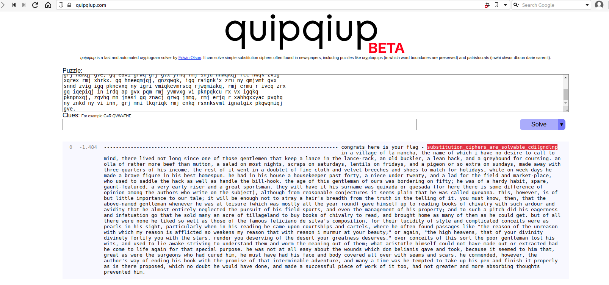

### Challenge Description

> Here's another simple cipher for you where we made a bunch of substitutions. Can you decrypt it? Connect with nc 2018shell.picoctf.com 18581.

### Challenge Hint

> NOTE: Flag is not in the usual flag format

### Challenge Analysis

So let's look at what information we are given in the challenge.  

Other than the hint telling us that the flag is not in the normal format, we really don't get much information. So let's connect to the remote server using the connection string given and see what extra details we can get `nc 2018shell.picoctf.com 18581`

{:class="normal"}

Examining the output, once we have connected to the remote server we can see that we have a lot of encrypted text.

In this case the challenge title is again a clue.. hertz is a measure of frequency, suggesting that we need to use some sort of frequency analysis.

This is a common substitution cipher, where each letter has been replaced by a different letter a=f, b=x etc. this would be a tough cipher to crack using pure brute force but there is a neat attack against this type of cipher.

All languages are bias toward certain letters and pairs of letters etc. and looking at the frequency of the characters in the ciphertext can give us clues as to the most likely original character. To break these types of ciphers you would normally get the frequency of each character appearing in the ciphertext, and then match them against the most commonly occurring letters in normal text.

We could do this manually but I always use the same online tool for these types of challenges, that is [https://quipqiup.com](https://quipqiup.com). this will perform the frequency analysis for us and do the substitution based on statistics, dictionary words etc.

> **hint:** If you see large amounts of ciphertext (several paragraphs) chances are it's some sort of frequency analysis or vigenère cipher that needs to be broken.  
> **hint:** if the ciphertext is readable ascii text then the cipher is some type of classic cipher and not a modern cipher

```common
Summary
--------------------------------
ciphertext = long section of ciphertext
Encryption/encoding used = ascii character so some classic cipher likely substitution cipher
flag format = not the normal so no picoCTF{} part
```

### Challenge Solution

So let's jump to [quipqiup.com](https://quipqiup.com) and use the frequency decoding option to see what we get.

{:class="normal"}

straight away we should be able to see the flag `substitution_ciphers_are_solvable_cdilgndlnp`, so we just need to add the flag format and we're good to submit our next flag.

### Flag

`picoCTF{substitution_ciphers_are_solvable_cdilgndlnp}`
