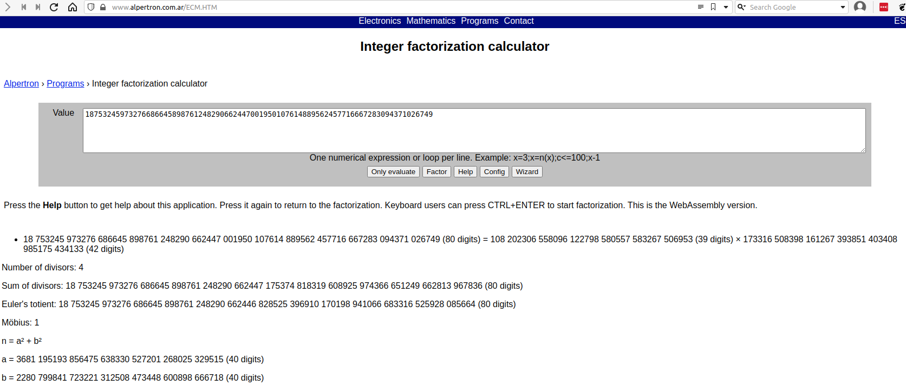

### Challenge Description

> Dr. Xernon made the mistake of rolling his own crypto.. Can you find the bug and decrypt the message? Connect with `nc 2018shell.picoctf.com 1317`

### Challenge Hint

> Just try the first thing that comes to mind.

### Challenge Analysis

So let's look at what information we are given in the challenge.  

OK so other than the name suggesting RSA we really aren't given much to go on, so we might as well connect to the remote server and see what more information we're given.

```terminal
$ nc 2018shell.picoctf.com 1317
c: 11633473401753833227381996202095769980909494647441709418852060539801819900238763
n: 18753245973276686645898761248290662447001950107614889562457716667283094371026749
e: 65537
```

The first thing that jumps out at me is the size of n, it looks way too small, which means we can probably factor n and hence break RSA. Given that we really haven't got anything else to go by, factoring the small looking n value seems to be the way to go.

### Challenge Solution

> **Note:** When attempting to factor large numbers I tend to use some online tools to help do the heavy lifting, I've listed some offline and online factoring tools in the resources below that might be useful.

My normal approach for these challenges is to throw the n value into the [factordb.com](http://factordb.com) website and see if it has the factors. That normally works but on this occasion it didn't so it looks like we'll have todo a bit more work.

>**Note:** I noticed when I reconnected to the remote server that it gave me different values, I actually did this a few times until the value I got for n actually worked on factordb.com. and I didn't have to actually do any factoring. For the writeup however I'm going to assume that factordb didn't have the result, and how we'd go about solving normally.

We can use an online factorisation calculator such as the one I used from [Alperton](https://www.alpertron.com.ar/ECM.HTM) to do the calculations for us. These can take a few minutes to run depending on the size values we're trying to factor. After only a couple of minutes I had my result.

{:class="normal"}

From the online calculator we now had the values for p and q.

`p = 108202306558096122798580557583267506953  
q = 173316508398161267393851403408985175434133`

At this stage we now had everything to work out d and perform a normal RSA decryption.

```python
c = 11633473401753833227381996202095769980909494647441709418852060539801819900238763
n=  18753245973276686645898761248290662447001950107614889562457716667283094371026749
e=  65537
p = 108202306558096122798580557583267506953
q = 173316508398161267393851403408985175434133

d = pow(e,-1,(p-1)*(q-1))
plaintext = pow(c,d,n)

flag = bytes.fromhex(hex(plaintext)[2:])
print (flag.decode())
```

And we have another flag.

### Flag

`picoCTF{us3_l@rg3r_pr1m3$_8546}`

### Resources

- Online Tools
[Alpertron online factorisation tool](https://www.alpertron.com.ar/ECM.HTM)
[Factordb.com online factorisation DB](http://factordb.com)

- Offline Tools
[Msieve suite for factoring large integers](https://sourceforge.net/projects/msieve/)
[Yafu Automated integer factorisation](https://sourceforge.net/p/yafu/wiki/Home/)
